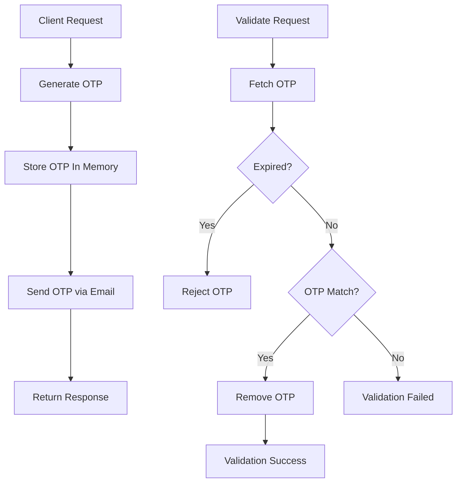

# OTP Microservice 🔐

A lightweight and scalable OTP (One-Time Password) microservice built using Spring Boot.

This service allows users to:
- Generate OTPs
- Send OTPs via email
- Validate OTPs securely
- Automatically handle OTP expiration

The project was designed and implemented completely from scratch as a backend systems learning project focused on:
- API design
- concurrency
- scalable architecture
- OTP lifecycle management
- asynchronous system evolution

---

# Current Architecture (V1)

The current version uses:

- In-memory OTP storage
- ConcurrentHashMap for thread-safe access
- Lazy expiration strategy
- SMTP-based email delivery
- RESTful APIs for OTP generation and validation

Unlike traditional DB-backed OTP systems, this version avoids unnecessary database persistence for temporary OTP data, making it significantly faster and lighter for single-instance deployments.

---

# OTP Flow



---

# Features

- Configurable OTP expiration
- Custom OTP generation
- Email integration using SMTP
- Thread-safe in-memory storage
- One-time OTP invalidation
- Global exception handling
- Environment variable support for secrets
- Clean modular architecture

---

# Tech Stack

- Java
- Spring Boot
- Maven
- JavaMailSender
- ConcurrentHashMap

---

# Project Structure

```text
com.junnu.app
├── controller
├── dto
├── notification
└── otp
```

---

# Future Improvements (V2)

Planned improvements include:

- Queue-based async email processing
- Retry mechanism for failed mail delivery
- Redis-based distributed OTP storage
- Rate limiting
- Resend cooldowns
- Docker deployment
- Distributed scalability support

---

